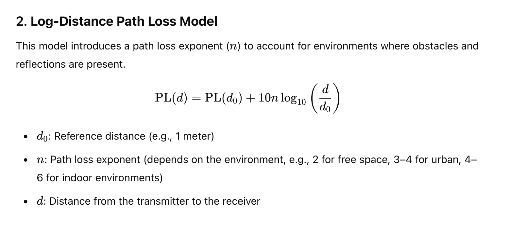
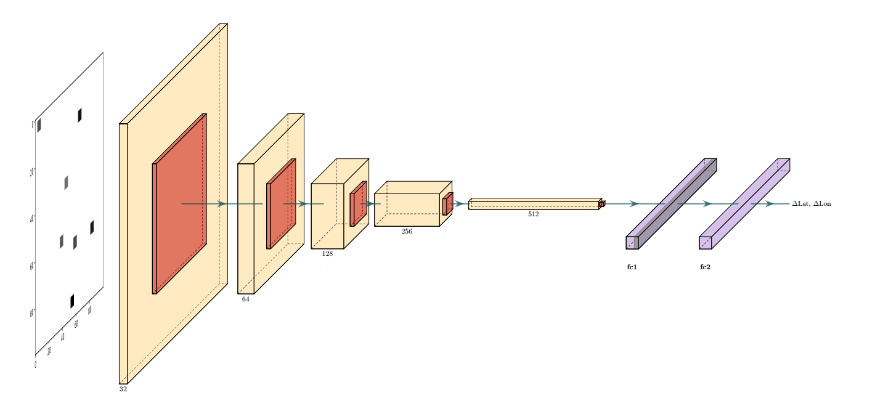

# Generate images base on RSSI and cell locations

## How to use
- Clone the repository
```
git clone https://github.com/anhvuleduc/PROJECT1_IMAGE.git
cd PROJECT1_IMAGE
```

- Install the dependencies
```
pip install -r requirements.txt
```

- Run mycode.ipynb (change the index in the SHOW IMAGE cell to show to corresponding data row's image)

## CSV file data format
- Data file is logFile_urban_data.csv
- Data format: Each row is: 
   - data_id, lat_ref,lon_ref, time, number of cells, (lac,cid,cell_lat,cell_lon,rssi), ...

## Path loss formula
- The attenuation of mobile signal can be modeled using the Log-Distance Path Loss Model:  

- Also, it cell can has its own surrounding environment, resulting in different path loss exponent (coefficient)

## Training
- We train the CNN model to predict $\Delta_{lat}, \Delta_{lon}$ from each data instance's image. These values are added to the centroid coordinates to produce the predicted location.
- The training is conducted on an NVIDIA RTX 4090 GPU for 10 epochs. You can find the checkpoint [here]
- Model architecture:



- To train the model from scratch, use:
```
python3 train.py --data_path path_to_CSV --batch_size 32 --lr 0.001 --epochs 10 --checkpoint_path your_model.pth
```
## Testing
- Inference using specific index:
```
python3 infer.py --data_path pathtoCSV --ckpt pathtockpt --idx youridx
```
=======
## Future work

- Using a more realistic formula to generate images
