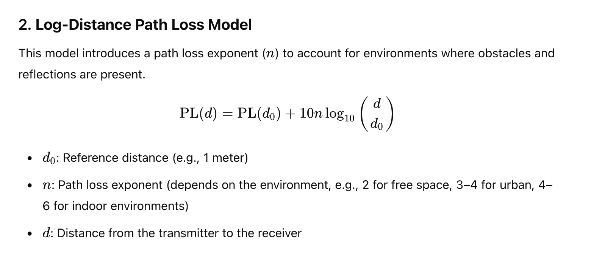

# Geolocation using CNN base on RSSI and cell locations

## Installation
- Clone the repository
```
git clone https://github.com/anhvuleduc/PROJECT1_IMAGE.git
cd PROJECT1_IMAGE
```

- Install the dependencies
```
pip install -r requirements.txt
```

- Run mycode.ipynb (change the index in the SHOW IMAGE cell to show to corresponding data row's image)


## Directories and files description

### assets: Reference materials & data
- cell_image.docx: original idea of representing the image
- IJAHUC_localization_manuscript_submit.pdf: original paper
- logFile_urban_data.csv: Actual cells' RSSI data


### CNN: Code for CNN
-  image_data.py:  helper functions to handle image -> tensor for train.py

- model.py: the CNN model for train.py

- train.py: Train the CNN, specific usage is described below

- infer.py: Inference using specific index, described in detail below

- urban_model.pth: It is the pretrained model by us, which can be infered (read the Testing part)

### show_image.ipynb
- visualize the data image for a specifix data row in csv file

## CSV file data format
- Data file is logFile_urban_data.csv
- Data format: Each row is: 
   - data_id, lat_ref,lon_ref, time, number of cells, (lac,cid,cell_lat,cell_lon,rssi), ...

## Path loss formula
- The attenuation of mobile signal can be modeled using the Log-Distance Path Loss Model:  

- Also, it cell can has its own surrounding environment, resulting in different path loss exponent (coefficient)

## Training
- We train the CNN model to predict $\Delta_{lat}, \Delta_{lon}$ from each data instance's image. These values are added to the centroid coordinates to produce the predicted location.
- The training is conducted on an NVIDIA RTX 4090 GPU for 10 epochs. You can find the checkpoint [here]
- Model architecture:


- To train the model from scratch, use:
   - Move to CNN directory
      ```
      cd CNN
      ```
   - Run train.py to train the model
      ``` console
      python3 train.py [--data_path PATH_TO_CSV] [--batch_size BATCH_SIZE] [--lr LEARNING_RATE] [--epochs EPOCHS] [--checkpoint_path PATH_TO_STORE_MODEL]
      ```

## Testing
- Inference using specific row index
- To test the model, use:
   - Move to CNN directory
      ```
      cd CNN
      ```
   - Basic usage to predict for data from ROW_INDEX in the csv
      ``` console
      python3 infer.py --idx ROW_INDEX
      ```
   - Advanced usage (with custom csv file)
      ``` console
      python3 infer.py [--data_path PATH_TO_CSV] [--batch_size BATCH_SIZE] [--ckpt PATH_TO_TRAINED_MODEL] --idx ROW_INDEX
      ```

   
## Future work
- Using a more realistic formula to generate images
- Optimize the CNN to avoid overfitting